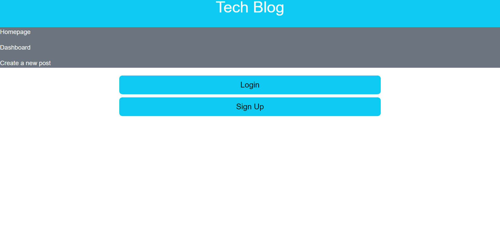

# Miles-Thomas-Tech-Blog
## Description
A blog space for posting and responding to queries regarding technology

## Table of Contents
* [Link to Deployed Site](#Link-to-Deployed-Site)
* [Screenshot of Deployed Site](#Screenshot-of-Deployed-Site)
* [Installation](#Installation)
* [Usage](#Usage)
* [Credits](#Credits)
* [License](#License)

## Link to Deployed Site
https://git.heroku.com/murmuring-falls-85586.git

## Screenshot of Deployed Site

## Installation
N/A

## Usage
When you open the site you’ll be presented with the homepage with log in and sign up prompts above the present quotes of the page. If you try to navigate the page you will be redirected to log in or sign up with a username and password. Once logged in you can view a separate page dedicated to post you have made and the login/sign up buttons will be replaced on the homepage with a log out. Each post has a view button that, when pressed will show you the contents of the post along with any comments that have been made. Posts can also be updated or deleted by the people who made them.

## Credits
N/A

## License
N/A
